# MintDiary - 薄荷日记
一款精美的卡片日记应用。

## 1.0.1 for macOS
1. 修复了开始页面标题显示错误的问题。
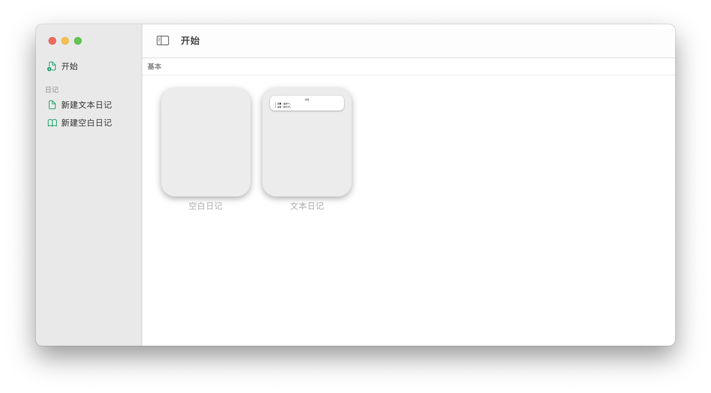
2. 重新设计窗口颜色及外观。
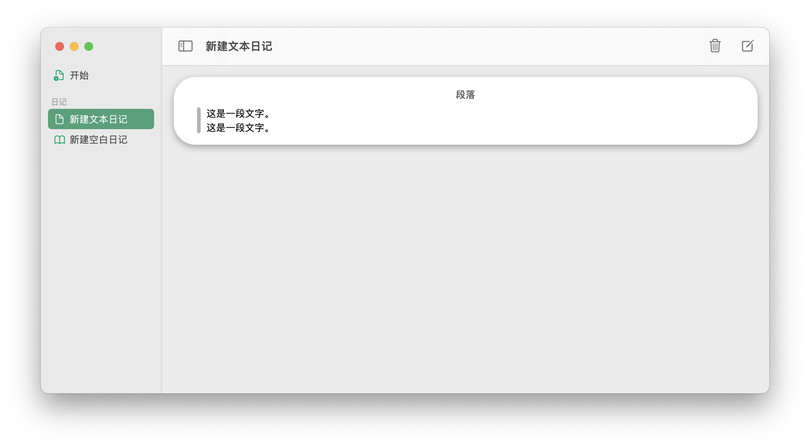
3. 修复了日记删除后仍然可编辑的问题。
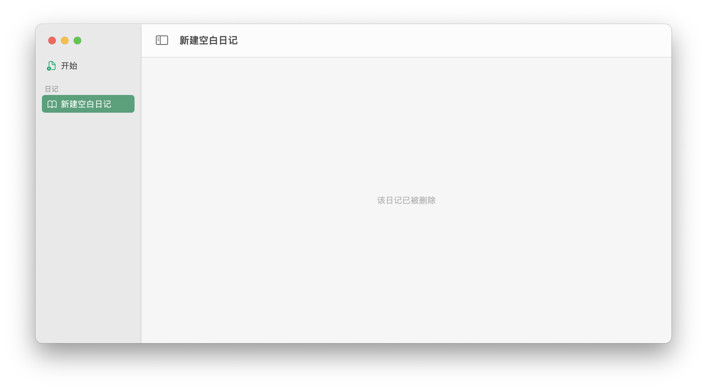

## 1.0.1 for iPadOS
1. 修复了新建页面标题显示错误的问题。
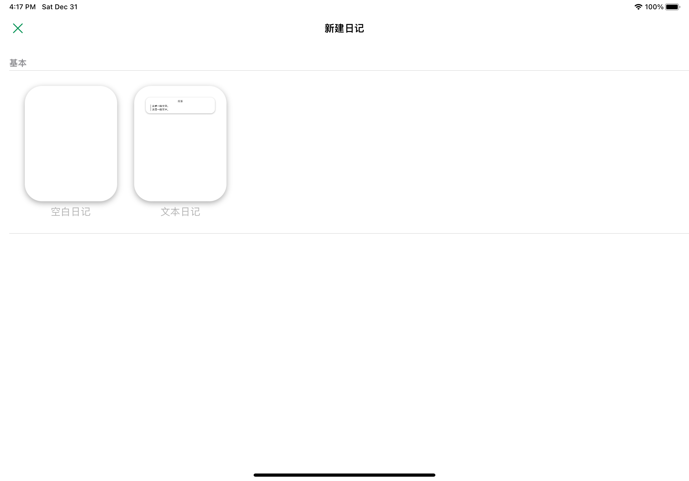
2. 增加了日记标题可编辑的功能。
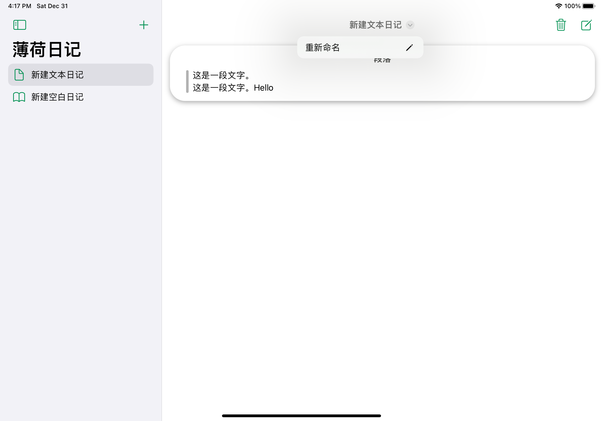

3. 修复了日记删除后仍然可编辑的问题。
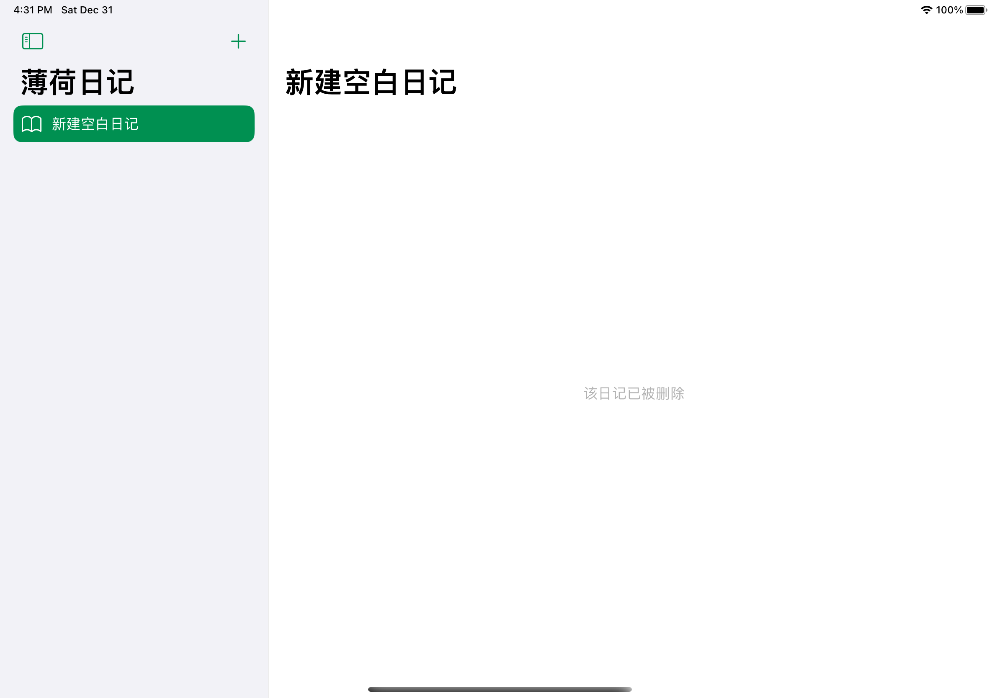

## 1.0.1 for iOS
1. 修复了新建页面标题显示错误的问题。
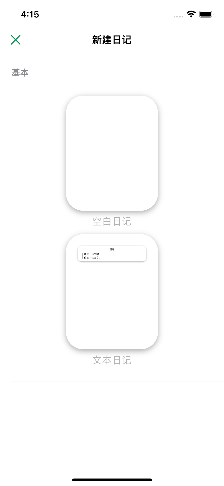
2. 增加了日记标题可编辑的功能。

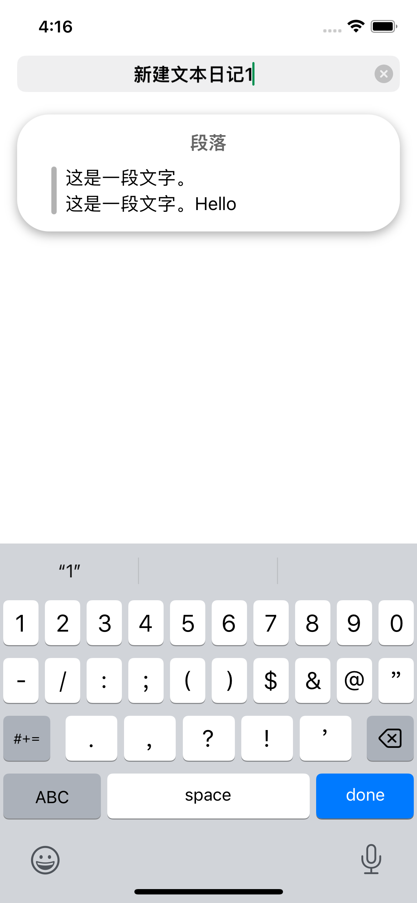
3. 修复了日记删除后仍然可编辑的问题。

## 1.0.0 for iPadOS
1. 专为iPad设计。
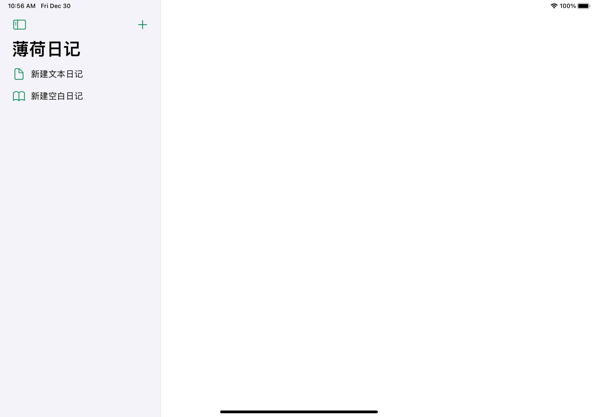
2. 提供两种日记模板，可以在模板基础上创建日记。
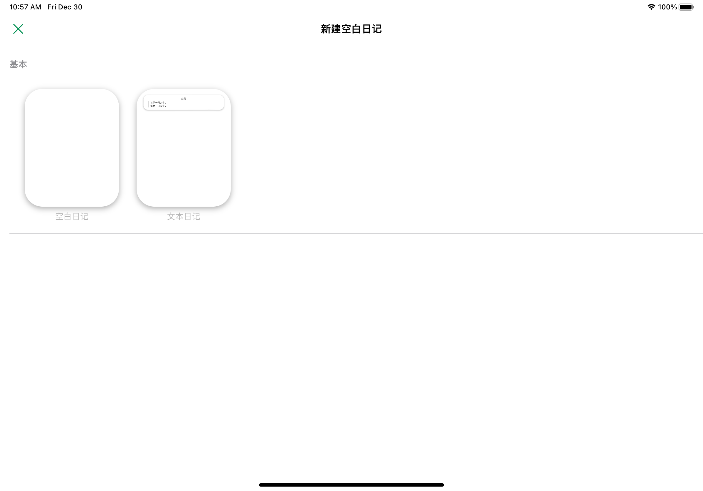
3. 支持日记卡片编辑，可以自由调整样式。

## 1.0.0 for iOS
1. 专为iPhone设计。
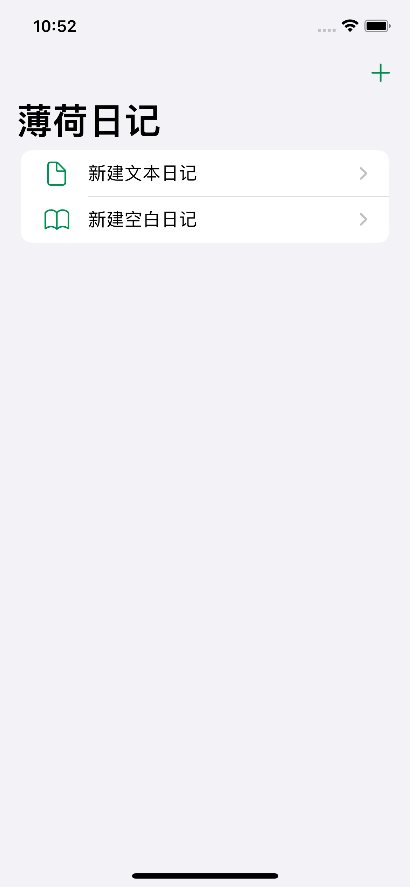
2. 提供两种日记模板，可以在模板基础上创建日记。
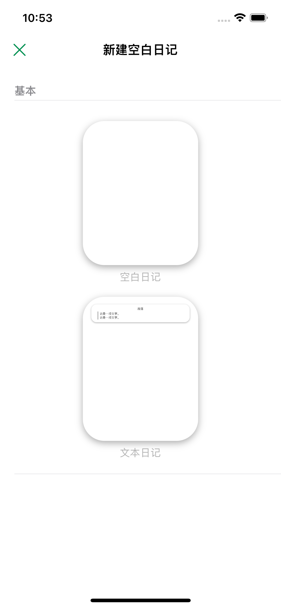
3. 支持日记卡片编辑，可以自由调整样式。
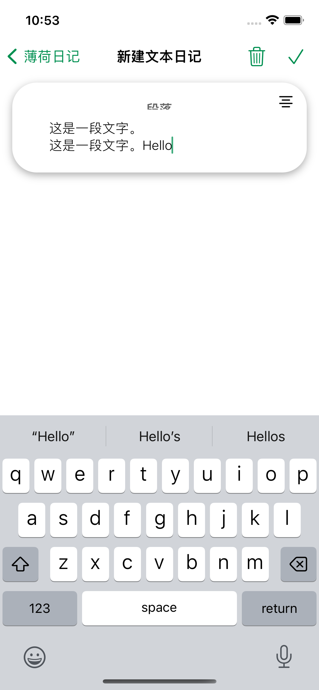

## 1.0.0 for macOS
1. 提供两种日记模板，可以在模板基础上创建日记。
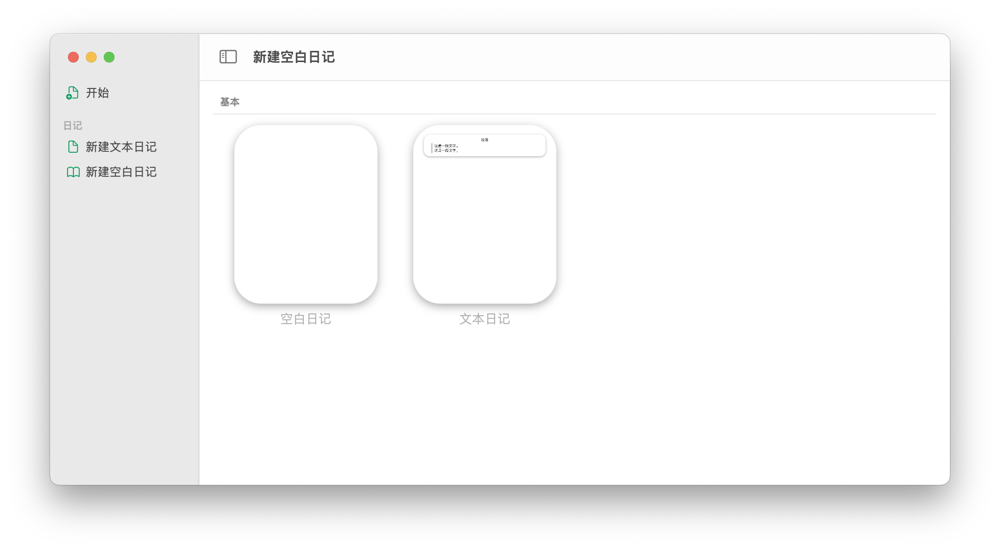
2. 支持日记预览，画面精美。
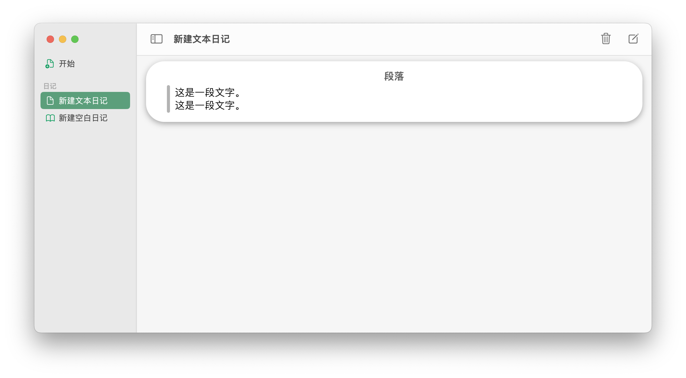
3. 支持日记卡片编辑，可以自由调整样式。
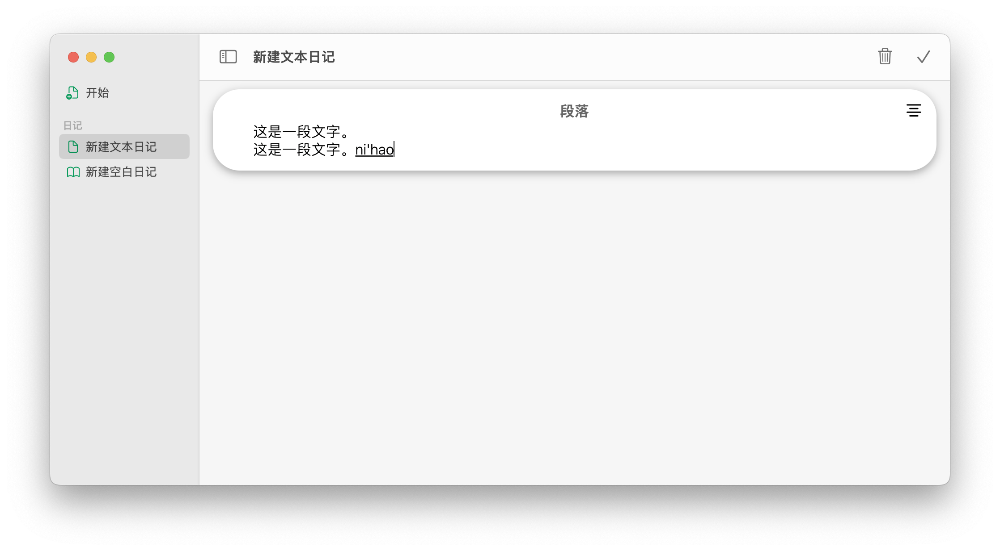